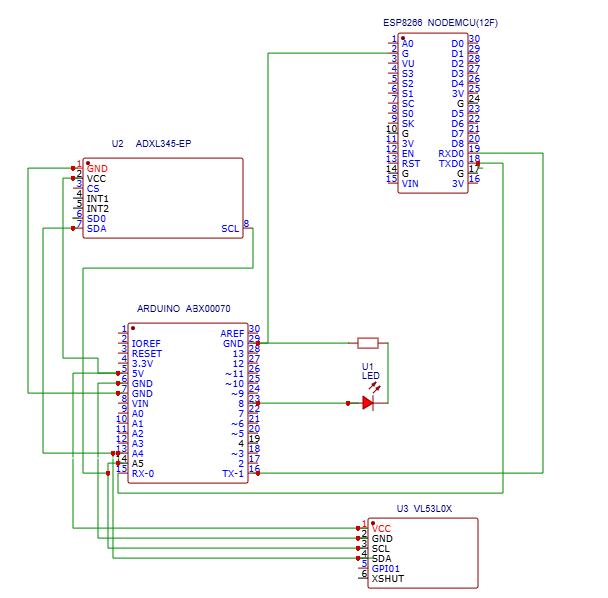
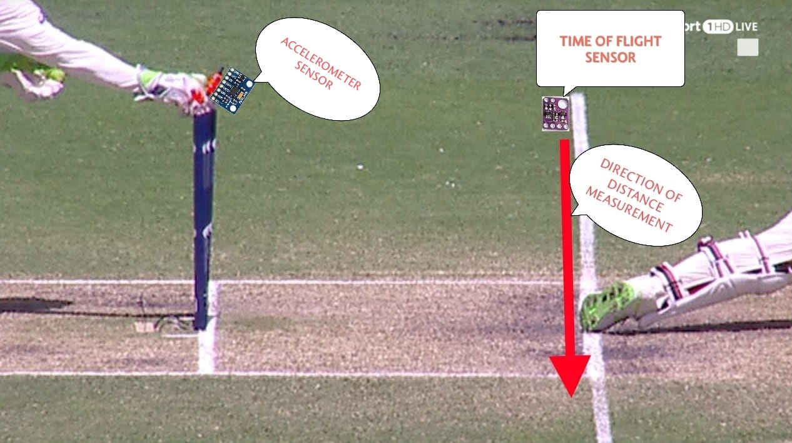
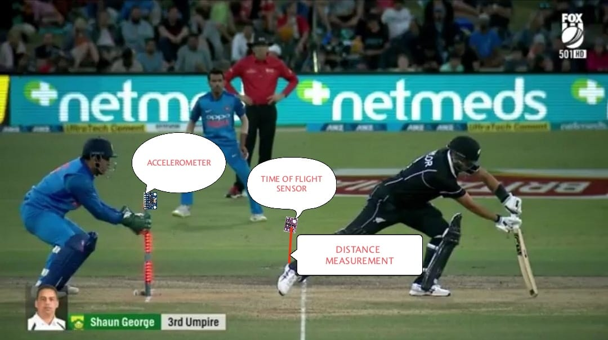

# 🏏 IoST: Automated Stumping Detection System for Error-Free Decision Making

## 📌 Project Overview
Cricket, a sport loved worldwide, still faces delays and inconsistencies in umpiring decisions, particularly in **stumping scenarios**.  
This project introduces an **Internet of Sports Things (IoST) based Smart Umpiring System** that integrates sensors, microcontrollers, and IoT to automate stumping detection.  

The system uses **Time-of-Flight (ToF) sensors** and an **accelerometer** to analyze the batter’s position relative to the crease and stump disturbances, while **LEDs** provide real-time feedback. Additionally, an **ESP8266 module** uploads match data to the **ThingSpeak cloud** for analysis and visualization.

---

## 🎯 Objectives
- Automate stumping decisions with high accuracy  
- Provide instant **“Out”** or **“Not Out”** results  
- Reduce human errors and umpiring delays  
- Enable **cloud-based decision logging** and visualization  
- Demonstrate the potential of **IoST in modern sports**  

---

## 🛠️ Components Used
- **Arduino Uno** – Central processing unit  
- **VL53L0X ToF Sensor** – Measures distance of batter’s foot from the crease  
- **MPU6050 Accelerometer** – Detects stump disturbance  
- **ESP8266 Wi-Fi Module** – Uploads match data to ThingSpeak cloud  
- **Red LEDs** – Visual decision indicators (Blinking = Out, Constant = Not Out)  
- Breadboard, jumper wires, soldering kit  

---

## ⚙️ System Workflow
1. **ToF sensor** measures the batter’s distance (D) from the crease.  
2. **Accelerometer** detects stump disturbances (A).  
3. **Arduino** processes input using thresholds:  
   - Distance Threshold: `Dₜ = 30 cm`  
   - Acceleration Threshold: `Aₜ = 5g`  
4. Decision-making logic:  
   - If `D > Dₜ` **AND** `A > Aₜ` → **OUT**  
   - Else → **NOT OUT**  
5. **LED Output**: Blinking (OUT), Constant (NOT OUT).  
6. Data sent to **ThingSpeak Cloud** for visualization.  

---

## 📊 Results
| Time (s) | Accelerometer (g) | ToF Distance (cm) | LED Indication | Decision |
|----------|-------------------|-------------------|----------------|----------|
| 0        | 4.8               | 25                | Constant       | Not Out  |
| 1        | 5.6               | 35                | Blinking       | Out      |
| 2        | 5.9               | -1                | Blinking       | Out      |
| 3        | 6.2               | 20                | Constant       | Not Out  |
| ...      | ...               | ...               | ...            | ...      |

✅ Achieved **95% decision accuracy**  
✅ Average **response time < 1000 ms**  
✅ Cloud integration ensures **real-time logging & analytics**  

---

## 📷 Images
### System Architecture


### Prototype – Out Case


### Prototype – Not Out Case


---

## 🚀 Future Scope
- Extend system to **no-ball detection** and **run-out verification**  
- AI-based predictive umpiring decisions  
- Mobile app integration for live updates  
- Expansion to **multi-sport IoST applications**  

---

## 📄 Publication
- [*IoST: Automated Stumping Detection System for Error-Free Decision Making*](https://ieeexplore.ieee.org/document/11077022) – IEEE (Accepted, 2025)

---

## ⭐ How to Run
1. Clone the repository:
    ```bash
   git clone https://github.com/Rudrateja123/IoST-Automated_Stumping_Detection_System_for_Error-Free_Decision_Making.git
2. Upload Arduino/ESP8266 code from /Codes to your board.
3. Connect sensors and modules as per /Images/Schematic_Architecture.png.
4. View decision output via LEDs and monitor data on ThingSpeak Cloud.
